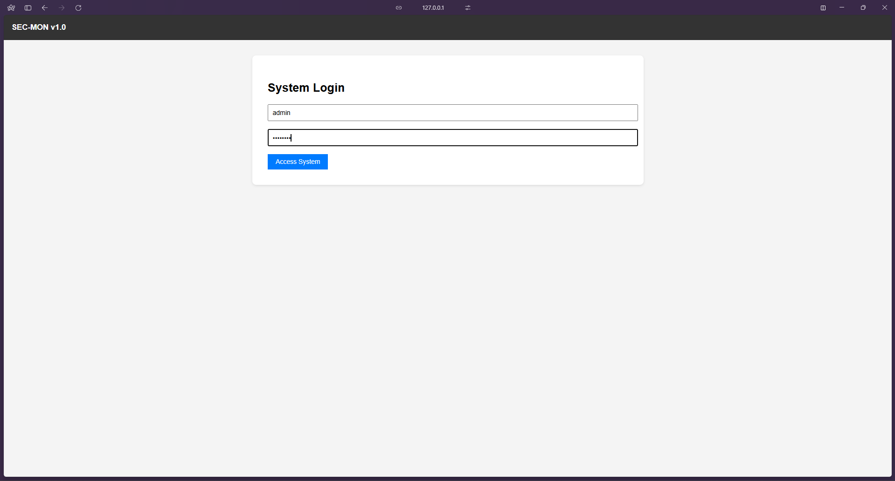
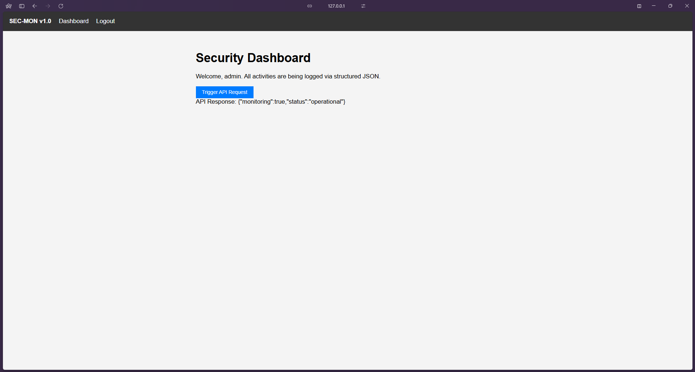
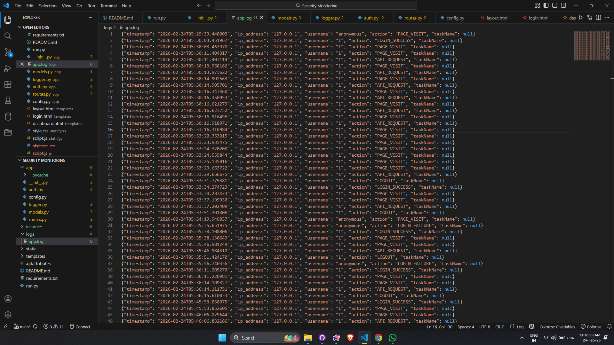
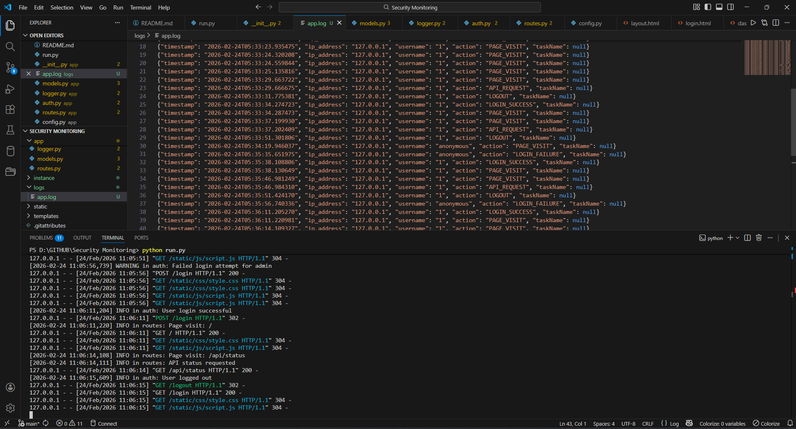

## INTERNSHIP PROJECT [03]

---

# Security Monitoring & Incident Response

---

*Organization:* **Cryptonic Area**  <br>
*Duration:* **19 – 28 February 2026**  

**Project Type:** Web Application Based Security Monitoring System  
**Domain:** Cyber Security | Log Analysis | Incident Response  

---

## Project Overview

### Project Purpose

This project is a Security Monitoring & Incident Response Web Application designed to simulate real-world SOC (Security Operations Center) operations.

It demonstrates how web application activity can be monitored, logged, analyzed, and used to detect suspicious behavior.

---

### Objectives

- Develop a custom web application
- Generate structured logs from user activity
- Analyze logs for abnormal behavior
- Create detection rules based on real activity
- Classify incidents based on severity
- Define structured incident response procedures
- Improve security maturity through practical implementation

---

### System Functionality

The application includes:

- User authentication (Login / Logout)
- Dashboard interface
- API request simulation
- Automatic structured logging of:
  - Login attempts
  - Page visits
  - API requests
  - Logout events

All activity is recorded in [Log Data File](/logs/app.log) for analysis.

## Tech Stack

### Backend
- Python
- Flask
- Flask-Login
- Flask-SQLAlchemy

### Frontend
- HTML
- CSS
- JavaScript
- Jinja2 Templates

### Database
- SQLite

### Logging & Analysis
- Python Logging Module
- python-json-logger
- JSON Structured Log Files

### Environment
- Local Development Server
- Windows / Linux Compatible

## System Architecture

### Overview

The system follows a layered architecture to separate responsibilities between application, logging, storage, and analysis components.

It ensures modular design and structured security monitoring.

---

### Architecture Layers

#### 1. Web Application Layer
Built using Flask and handles:

- User authentication
- Dashboard rendering
- API endpoints
- User interactions

All user activities are captured and forwarded to the logging module.

---

#### 2. Logging Layer
Implemented using Python logging module with JSON structured format.

It captures:

- Timestamp
- IP Address
- Username
- Action performed

Logs are stored in:
`logs/app.log`

---

#### 3. Storage Layer

The system uses:

- SQLite database → Store user credentials
- Log file storage → Store activity records

---

#### 4. Analysis Layer

The analysis module:

- Parses log files
- Applies threshold-based detection rules
- Identifies suspicious behavior
- Generates security alerts

This simulates SOC-level monitoring inside a controlled environment.

## Project Folder Structure
```
Security-Monitoring-App/
│
├── app/
│ ├── __init__.py
│ ├── auth.py
│ ├── config.py
│ ├── logger.py
│ ├── models.py
│ └── routes.py
│
├── static/
│ ├── css/
│ │ └── style.css
│ └── js/
│   └── script.js
│
├── templates/
│ ├── layout.html
│ ├── login.html
│ └── dashboard.html
│
├── logs/
│ └── app.log
│
├── analysis/
│ └── docs/
│ ├── 01-Project-Overview.md
│ ├── 02-System-Architecture.md
│ ├── 03-Log-Analysis.md
│ ├── 04-Detection-Logic.md
│ ├── 05-Incident-Scenarios.md
│ ├── 06-Incident-Response.md
│ └── 07-Future-Improvement.md
│
├── requirements.txt
├── run.py
└── README.md
```
## Features

### Authentication System
- User Login & Logout
- Session Management
- Default Admin Account Creation

### Structured Logging
- Automatic JSON-based logging
- Logs include:
  - Timestamp
  - IP Address
  - Username
  - Action Type

### Activity Monitoring
- Track page visits
- Track API requests
- Monitor login attempts
- Monitor session behavior

### Detection Engine
- Threshold-based rule detection
- Brute-force detection
- API request flood detection
- Suspicious session detection
- Pattern-based anomaly identification

### Incident Simulation
- Simulates real-world security incidents
- Generates alerts based on detection rules

### Incident Response Support
- Classifies severity levels
- Provides structured response procedures
- Enables manual investigation through logs

## Log Analysis

### Objective

Log analysis is performed to examine system-generated logs and detect abnormal behavior based on activity patterns.

Logs are stored in:

```
logs/app.log
```

---

### Log Format Example

```json
{
  "timestamp": "2026-02-24T05:30:03.451967",
  "ip_address": "127.0.0.1",
  "username": "1",
  "action": "LOGIN_SUCCESS",
  "taskName": null
}
```

---

### Log Fields Explanation

| Field | Description |
|--------|------------|
| timestamp | Time when event occurred |
| ip_address | Source IP address |
| username | User performing the action |
| action | Type of event |
| taskName | Additional task information |

---

### Observed Activity Patterns

- Frequent API requests in short time window  
- Rapid login and logout cycles  
- Multiple failed login attempts  
- Repeated page visits in automation pattern  

Log analysis forms the foundation for detection rules and incident identification.

## Detection Rules

### Objective

Detection rules define security thresholds used to identify abnormal or suspicious behavior inside the system.

These rules are applied on:

```
logs/app.log
```

---

### Detection Rule Table

| Rule ID | Condition | Severity | Action |
|----------|----------|----------|--------|
| D-01 | More than 3 LOGIN_FAILURE from same IP within 5 minutes | High | Generate Alert |
| D-02 | More than 10 API_REQUEST events within 2 minutes | Medium | Generate Alert |
| D-03 | LOGIN_SUCCESS followed by immediate LOGOUT (<1 min) | Medium | Flag Behavior |
| D-04 | Repeated PAGE_VISIT + API_REQUEST patterns | Low | Monitor |

---

### Rule Explanation

#### D-01 – Brute Force Detection
Detects multiple failed login attempts from same IP.

Possible Risk:
- Credential guessing
- Unauthorized access attempt

Action:
- Generate High Severity Alert
- Log incident for investigation

---

#### D-02 – API Flood Detection
Detects excessive API requests in short time.

Possible Risk:
- Automated script
- Data scraping
- API abuse

Action:
- Trigger Medium Alert
- Monitor session activity

---

#### D-03 – Suspicious Session Cycling
Detects rapid login and logout behavior.

Possible Risk:
- Session testing
- Automated login script

Action:
- Flag for security review

---

#### D-04 – Activity Pattern Repetition
Detects repeated interaction patterns.

Possible Risk:
- Bot behavior
- Automated system interaction

## Incident Scenarios & Response

This section defines practical security incidents based on detected abnormal behavior in the system.

Each scenario includes:

- Detection Trigger  
- Severity Level  
- Impact Analysis  
- Response Steps  

---

### Scenario 1: Brute Force Login Attempt

**Detection Trigger:**
- More than 3 failed login attempts from same IP within 5 minutes

**Severity:** High  

**Impact:**
- Account compromise risk  
- Credential guessing attack  

**Response Steps:**
1. Block the suspicious IP temporarily  
2. Lock the affected user account  
3. Review authentication logs  
4. Notify administrator  
5. Reset password if required  

---

### Scenario 2: API Request Flooding

**Detection Trigger:**
- More than 10 API_REQUEST events within 2 minutes  

**Severity:** Medium  

**Impact:**
- System resource abuse  
- Automated attack  
- Data extraction attempt  

**Response Steps:**
1. Monitor session activity  
2. Apply rate limiting  
3. Identify source IP  
4. Add IP to watchlist  

---

### Scenario 3: Suspicious Session Cycling

**Detection Trigger:**
- LOGIN_SUCCESS followed by immediate LOGOUT  
- Session duration less than 1 minute  

**Severity:** Medium  

**Impact:**
- Session testing  
- Automated login script  
- Possible credential misuse  

**Response Steps:**
1. Track session history  
2. Verify user legitimacy  
3. Check IP consistency  
4. Enable additional authentication checks  

---

### Scenario 4: Rapid Page & API Interaction

**Detection Trigger:**
- PAGE_VISIT + API_REQUEST repeated rapidly  

**Severity:** Low to Medium  

**Impact:**
- Bot-like behavior  
- Automated interaction  
- Reconnaissance activity  

**Response Steps:**
1. Log behavior for monitoring  
2. Increase detection sensitivity  
3. Escalate if pattern repeats  
4. Combine with other anomaly signals for analysis  


## Incident Response Procedure

### Objective

This section defines the structured process followed when a security alert is triggered by the detection system.

The goal is to ensure consistent handling of incidents and minimize potential damage.

---

### Alert Handling Workflow

```
Detection → Alert Generation → Analyst Review → Investigation → Action → Documentation → Closure
```

---

### Step 1: Alert Generation

Alerts are automatically generated when detection rules are triggered.

Alert includes:

- Rule ID  
- User  
- IP Address  
- Severity  
- Timestamp  
- Triggered Condition  

---

### Step 2: Analyst Review

Security analyst verifies:

- Is it a true positive or false positive?  
- Is the activity legitimate?  
- Are multiple events correlated?  

Logs are reviewed for validation.

---

### Step 3: Investigation

Investigation includes:

- Reviewing activity timeline  
- Checking login history  
- Analyzing API request pattern  
- Identifying affected user accounts  
- Verifying source IP reputation  

Evidence is collected from:

```
logs/app.log
```

---

### Step 4: Response Actions

#### Low Severity
- Monitor activity  
- Add user to watchlist  

#### Medium Severity
- Apply temporary restrictions  
- Increase monitoring  
- Enable additional verification  

#### High Severity
- Block suspicious IP  
- Lock account  
- Escalate to administrator  
- Perform forensic analysis  

---

### Step 5: Documentation

After action:

- Incident is documented  
- Evidence is stored  
- Root cause is identified  
- Response steps recorded  

---

### Step 6: Incident Closure

Incident is closed when:

- Threat is mitigated  
- System is secured  
- No further suspicious activity detected  

Post-incident review is performed for improvement.


## Future Improvement Scope

This section defines potential enhancements to improve system security, automation, and detection accuracy in future versions of the project.

---

### 1. Real-Time Alert Dashboard

**Current System:**
- Logs stored in file
- Detection performed via script

**Future Enhancement:**
- Live dashboard showing:
  - Active alerts
  - Alert severity distribution
  - Recent suspicious activity
  - Live log streaming

**Technology:**
- AJAX / WebSockets
- Chart.js
- Real-time UI updates

---

### 2. Automated Alert Notifications

Currently:
- Alerts are generated but manually reviewed

Future Improvement:
- Send automatic notifications via:
  - Email
  - Slack
  - Telegram
  - System notifications

**Benefit:**
- Faster response time
- Improved monitoring efficiency

---

### 3. Advanced Anomaly Detection

Current System:
- Threshold-based detection rules

Future Upgrade:
- Machine learning-based anomaly detection
- User behavior profiling
- Baseline activity modeling
- Statistical deviation detection

This improves detection accuracy beyond static rules.

---

### 4. Automated IP Blocking

Future Enhancement:
- Automatically block IP on high severity alerts
- Firewall integration
- Temporary IP quarantine

This converts detection into active prevention.

---

### 5. SIEM Integration Simulation

Future Possibility:
- Export logs in structured format
- Integrate with:
  - ELK Stack
  - Splunk
  - Graylog

Benefit:
- Enterprise-level security monitoring experience

---

### 6. Enhanced Logging Security

Improvements:
- Log rotation
- Log encryption
- Log integrity verification (hashing)
- Digital signature for tamper detection

## Learning Outcomes

Through this project, I gained practical knowledge and hands-on experience in cybersecurity monitoring and web application security.

---

### Technical Skills Developed

- Developed a full-stack web application using Flask
- Implemented structured logging with JSON format
- Worked with SQLite database integration
- Implemented authentication and session management
- Built threshold-based detection logic

---

### Security Concepts Understood

- Log-based security monitoring
- Brute force detection
- API abuse detection
- Suspicious behavior analysis
- Incident classification by severity
- Structured incident response process

---

### Practical Experience Gained

- Simulated real-world SOC environment
- Designed custom detection rules
- Analyzed system logs for anomalies
- Understood attacker behavior patterns
- Implemented alert-based monitoring system

---

### Analytical Skills

- Identified abnormal activity patterns
- Correlated log events
- Applied rule-based security detection
- Improved system monitoring methodology

---

### Professional Growth

- Understood security operations workflow
- Learned documentation standards for technical projects
- Improved problem-solving skills in cybersecurity domain

## Analysis / Screenshots

This section contains visual evidence of the system functionality and monitoring interface.

---

### Login Page



Description:
- User authentication interface
- Login form with username and password
- Access control entry point

---

### Dashboard



Description:
- Main monitoring interface
- Displays user activity
- API request trigger button
- Live system interaction

---

### Log File



Description:
- Structured JSON log entries
- Recorded user activities
- Timestamp-based tracking

---

### Terminal / Detection Output



Description:
- Detection script execution
- Alert generation output
- Rule-based anomaly detection results

## Conclusion

The Security Monitoring & Incident Response Web Application demonstrates practical implementation of log-based security monitoring in a controlled environment.

This project successfully integrates:

- User authentication
- Structured logging
- Threshold-based detection rules
- Incident simulation
- Structured response procedures

It reflects real-world Security Operations Center (SOC) principles by converting application activity into actionable security alerts.

---

### Key Achievements

- Built a custom monitoring system from scratch
- Implemented automated log generation
- Designed detection rules for anomaly identification
- Created incident response workflow
- Simulated enterprise-level security monitoring concepts

---

### Final Outcome

The project provides hands-on experience in:

- Cybersecurity monitoring
- Log analysis
- Incident detection
- Security automation

It strengthens understanding of how security events are detected, analyzed, and mitigated in real systems.

## Installation Steps

### 1. Clone the Repository

```bash
git clone https://github.com/monxcode/Security-Monitoring.git
cd Security-Monitoring
```

---

### 2. Create Virtual Environment (Recommended)

```bash
python -m venv venv
```

Activate:

**Windows**
```bash
venv\Scripts\activate
```

**Linux / Mac**
```bash
source venv/bin/activate
```

---

### 3. Install Dependencies

```bash
pip install -r requirements.txt
```

---

### 4. Create Logs Directory

```bash
mkdir logs
```

---

### 5. Run Application

```bash
python run.py
```

---

### Default Login Credentials

```
Username: admin
Password: admin123
```

Application runs at:

```
http://127.0.0.1:5000
```
